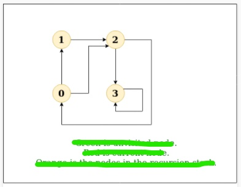
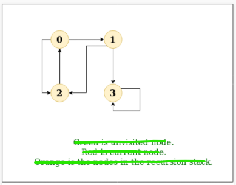

## graph
### adjacency matrix
### adjacency list
### direction vector
### dfs
그래프에서 깊이 우선 탐색은 트리의 깊이 우선 탐색과 유사합니다. 트리와의 차이점은 그래프는 (특정 노드를 2번 방문할 수도 있는)순환을 포함할 수 있다는 점입니다. 동일한 노드를 한번 더 처리하는 것을 피하기 위해서 방문 여부를 bool값 형태로 저장하는 배열을 사용합니다.
> Depth First Traversal (or Search) for a graph is similar to Depth First Traversal of a tree. The only catch here is, unlike trees, graphs may contain cycles (a node may be visited twice). To avoid processing a node more than once, use a boolean visited array.

Example:
```diff
Input: n = 4, e = 6
0 -> 1, 0 -> 2, 1 -> 2, 2 -> 0, 2 -> 3, 3 -> 3
Output: DFS from vertex 1 : 1 2 0 3
```


```diff
Input: n = 4, e = 6
2 -> 0, 0 -> 2, 1 -> 2, 0 -> 1, 3 -> 3, 1 -> 3
Output: DFS from vertex 2 : 2 0 1 3
```


<br>

***reference***
- https://www.geeksforgeeks.org/depth-first-search-or-dfs-for-a-graph/

### bfs
### tree travesal